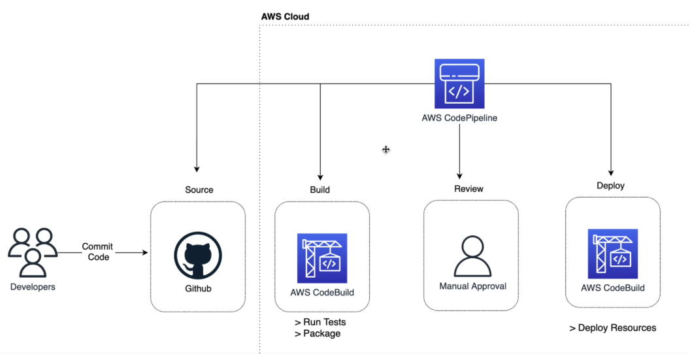

## CI

CI stands for Continuous Integration. It is a development practice that requires developers to integrate code into a shared repository several times a day. Each check-in is then verified by an automated build, allowing teams to detect problems early.

Basically in this example would be the developer pushing the code to the repository, and the CI server would automatically run the tests and build the code. with AWS Code Build

## CD

CD stands for Continuous Deployment. It is a strategy to automate the deployment of code to production. It’s the next step of Continuous Integration.

In continues deployment, the code is automatically build and deployed.

## AWS CodePipeline

AWS CodePipeline is a continuous integration and continuous delivery service for fast and reliable application and infrastructure updates. CodePipeline builds, tests, and deploys your code every time there is a code change, based on the release process models you define.
